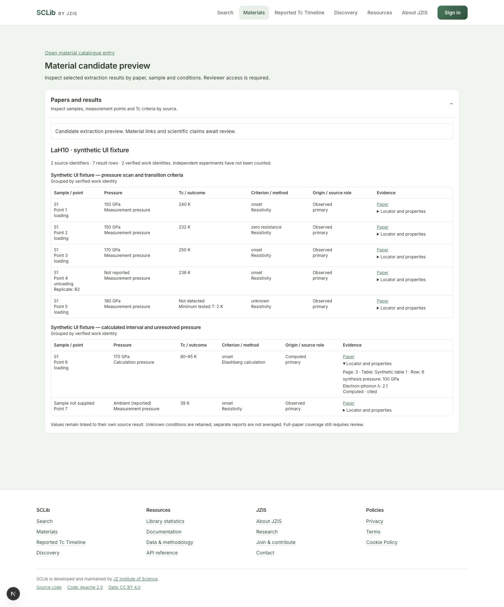
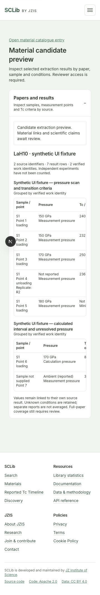

# Materials V3 工程验收记录

日期：2026-10-10。开发基线：`origin/main` 的 `5a256f2ceafd4d2db3ab1393c8d10443936980b6`；独立分支 `codex/materials-v3-local-ner-20261010`。原工作目录的用户修改保留，线上数据与暂停流程未修改。最终 code SHA、迁移 seal 和完整测试结论由移交时的独立最终收据绑定。

本阶段完成了可审阅的 schema、NER 代码、队列 adapter、私有数据快照和材料报告界面。真实 Qwen 生成、50 篇三模型抽取、人工 gold、源范围冻结和生产切换均未完成，因此本记录不作“模型可以胜任全库”的结论。

2026-10-10用户授权切换至Qwen3.5-9B MLX 4-bit，本轮固定revision为 `8b2b98c00a6b4d291155e4890773ca8f769aee53`。旧35B pin和下文历史回执保留。新增独立9B资源配置、统一共享锁默认路径和精确development来源staging，并修正Gemini适配器读取既有 `GCP_PROJECT` 配置及Gemini 3 thinking参数；相关90项测试及Ruff通过。9B真实tokenizer对209个完整prompt计数3,060–10,096，预留4,096输出均不超过16,384；[新回执](pilot/materials-ner-qwen3.5-9b-tokenizer.preflight.v1.json)不是模型推理。首轮错误计数的私有回执保留且已废弃；10篇开发原始输入在CPU复现；Mini联调暴露公开准备收据与私有manifest的父摘要字段不同，已修复并以文档指定的真实公开收据复现10篇全部成功，分别绑定父manifest与实际输入摘要。下载/真实load/推理按Mini本轮收据记录。

## 已实现与实际验证

| 部分 | 已实现 | 实际验证与边界 |
|---|---|---|
| 数据 contract | Material → Work → sample/state → series/point → event → claim →逐字段 evidence；数值/范围/界限、原始单位、origin/source role、判据、重复及路径 | source-grounded semantic fixtures；未知样品不合并、未知压力不当 ambient、未检出不造 Tc=0 |
| 科研存储 | 0092 增量迁移与 14 个新表；旧冻结模型保持；Tc 仍唯一规范存储在 material_claims | 模型 FK/条件/定性属性与真实 PG 测试；历史 rehearsal v7通过，最后精确 commit 的 seal另附 |
| 来源与解释 | 同一原文 occurrence 不含模型/解释值；多个 run 分开，显式选择一个来源解释 | 导入幂等、跨来源 evidence 拒绝；成功导入不修改 catalogue；新记录 append-only |
| 全文处理 | 全部文档记录、稳定 Unicode offset、表头/脚注 context、PDF warning/图像 gaps、正文与独立 supplementary captures | 所有字符/块纳入覆盖；附件未完成不能给全文通过；附属源权限独立，整篇 budget共享 |
| NER | MLX +固定 Qwen、Gemini、OpenAI Responses；同语义 prompt/schema、有限修复/重试/拆块 | JSON/值/单位/quote/行绑定验证；输出触顶与资源失败保存部分回执；没有实际模型抽取 |
| 恢复 | SQLite WAL/FULL、原子 claim/fencing、每块与 attempt 收据、恢复原成功响应 | 验证 attempt 与 block fsync 间崩溃、重试、超长拆分和资源停止；不重复生成已成功或已触顶父块 |
| 队列 | 独立 ner_qwen_mlx kind/capability，绑定输入/代码/schema/provider/budget/model/runtime hashes；沿用 mTLS/outbox 协议 | 真实本机 HTTP/SQLite 故障测试通过；ACK 丢失不重推理；使用的是合成 provider，Mini 真实联网仍 pending |
| 比较 | 原子 tuple、单位规范化、每族/字段/难例指标、依赖组 paired bootstrap、预测证据审计与空值恢复分母 | 拒绝模型共识 gold、空分母高分、混用 provider label/config或不同 token/time budget；不匹配模型不计独立实验 |
| 盲审 | 随机 alias、source-only review packet、单独私有 mapping、完整 prediction IDs | 未知 claim 元数据/不同 Work 范围拒绝；A/B 身份、gold与prediction audits保持未标注 |
| 材料页 | 保留旧列表/筛选/排序/布局，在 Evidence 和详情加入按 Work 展开的 source result rows；另有私有候选 preview | 360/768/1440、负结果、区间、多判据、路径、未知/ambient、参数来源、locator、重试及键盘横向滚动验证；Observed Tc只配测量压力，Computed Tc只配计算压力，合成压力单独保留 |
| 治理 | source/material hold动态过滤；候选 API限 reviewer/admin；no-store、noindex | 匿名401、普通用户403；撤稿/hold/范围过滤回归；没有生产候选接纳或 snapshot激活 |

Migration rehearsal 会核旧数据/字段与冻结函数、0092→0091→0092 往返、14表的 UPDATE/DELETE/TRUNCATE拒绝、有候选数据时拒绝 downgrade。旧 head 的 inventory 仅在确认新表为空后排除新增表，不通过漏检掩盖历史数据变化。Downgrade 在检查空表前取得全部 V3 表和 event_properties 的排他锁，防止检查后并发写入再被删除。首次 CI 的 metadata-only 空库测试缺少迁移创建的 trigger function；在锁定并确认历史为空后使用 DROP FUNCTION IF EXISTS，实际空库往返复测通过。

## 来源与固定 tokenizer

真实 50 篇候选来源在 [准备收据](pilot/materials-ner-50.sources.prepared.v1.json)。每族 10，split 10/10/30；正文输入 24 PDF +26 HTML，原始 PDF 50份也已取得。parser `materials-blocks/1.3.0` 生成 209 初始块，获取/解析失败为 0。全部来源仍有图像或版面待审 gap；族/数据依赖组、Work 映射、license/传输范围、补充材料和难例标签未最终审查。它们不是 frozen corpus，NER 完成数为 0。

在独立 CPU 环境，用固定 revision 的真实 tokenizer及 chat template、关闭 thinking，对完整 prompt计数：209块输入为 3,060–10,096 tokens，预留4,096输出均不超过16,384；0个超预算块。见 [tokenizer receipt](pilot/materials-ner-qwen-tokenizer.preflight.v1.json)。此试验没有安装/加载模型权重，也没有生成结果；不能代替 MLX 兼容性、内存或NER准确率验收。初次试验缺 jinja2的失败记录保留，安装依赖后才得到该收据。

Mini 实机确认 M4 Pro/48 GiB；该节点任务已安装 `87a71c0e…` 的固定代码及冻结环境，完整核验17个模型文件、20.43 GB；18项离线检查及所选54项既有测试通过。真实 tokenizer 的完整合成提示词为2,747输入tokens，schema保留loading onset/zero与unloading onset三项，但数据是手工合成，真实生成未执行。节点当时可用内存27.21 GiB，低于36 GiB加载门槛；旧worker停止收据、服务监督与权限、真实生成与24h soak仍 pending。代码安装或权重下载不是 local_ready/compute_verified；后续修复提交的同步状态由最终收据单独记录。

## 工程测试收据

所有 PG/Redis 测试使用 `scripts/run_disposable_tests.py` 为本次调用新建的本机临时服务，拒绝外部 DSN，清除继承的云/邮件凭据；未连接或写生产数据库。公共源码不包含全文、PDF、annotation结果、真实凭据或私钥。

| 测试范围 | 收据与已知结果 |
|---|---|
| ingestion完整套件 | `ingestion-final-v2.xml`：1554 passed，34项既有 SQL编译deprecation warnings |
| compute staging +NER adapter | `compute-ner-final-v2.xml`：25 passed，真实本机HTTP/SQLite +合成 provider；无真实 MLX生成 |
| API新增数据/来源治理/科研 shadow | `api-auth-and-v3-final-v2.xml`：59 passed；最终压力归属及隔离复测 `api-pressure-and-isolation-final.xml`：27 passed；新增6个压力归属案例（另有1个缺值语义案例在初次API收集后加入），无错误压力回退 |
| frontend source +unit | `frontend-final.log`：46项源码检查通过；最后 `frontend-pressure-final.log`：unit 3201 passed、3个既有skip；最终 tsc 与 production build通过 |
| UI 浏览器 | [QA receipt](pilot/materials-v3-ui-qa.v1.json)，三个宽度，文档无水平溢出；表格自己滚动，keyboard初次观察19.5px、最终压力角色复核观察40px位移；临时viewport/tab/服务器已清理 |
| API全部收集项 | 初始8567项；原始运行在临时服务一小时能力到期前中断分组，记录4370项：4353 passed、6 skip、1失败、10 setup errors。失败为旧 corpus operator假设空DB（63≠3）；已改为基线与旧行不变校验。10 errors为本机PG锁表容量不足；只调整新建临时服务的 max_locks_per_transaction=1024，涉及两个模块40项全部复测通过。尾批A为2129 passed、3失败：恢复快照2项超过整库20,000行/32 MiB上限，改为独立服务模块且14项复测通过；另1项为Alembic默认禁用已有应用logger，单独日志测试通过、先运行迁移再运行日志测试重现失败，改为保留已有logger后迁移与correction两个模块71项通过。尾批B为2062 passed、3 skip，另有61个passed subtests。按实际JUnit与8574项最终collection逐项核对，跨批次及针对原因复测后的覆盖为8566 passed、8 skip，0遗漏、0未解决失败；10个随机UUID4参数采用唯一匹配并保留对应关系。这是多次真实收据合并，未称为一次完整干净运行；密封收据与最终CI状态另附 |
| scripts 边界及 runtime | 首次 CI 的2个旧迁移测试依赖表名列表完整字符串；改为执行受控 snapshot并检查所有旧行保留及新空表排除，相关48项通过。完整 `scripts-final-v2.xml` 为3176 passed、1个既有skip，另有148个passed subtests。随后对批次隔离与snapshot守卫复测79项通过。首次本机全跑误用了原checkout的editable package，保留30个collection errors，改为显式当前API PYTHONPATH后复测 |
| migration | 历史 v7通过；最终完整迁移在代码与文档冻结后，对最终commit重新密封，收据独立保存 |

此前采集失败还包括缺 pylatexenc、未提供隔离测试DB导致的旧 ingestion settings collection错误、早期迁移 rehearsal问题与旧 frontend依赖目录 tracing问题；均保留原日志，针对原因修复后再测试。没有通过跳过新 NER测试来取得通过结果。

界面截图使用明确标为 synthetic 的7行测试数据，证实显示逻辑；不代表真实论文抽取或线上候选接纳：

## 未完成的验收与下一步出口

| 出口 | 仍需要的实际证据 |
|---|---|
| M1 来源冻结 | 50篇族/Work/数据依赖/许可/附件/难例审查；必要同族替补；正式frozen manifest；两名标注者与仲裁者尚未指派 |
| M2 Mini runtime | 原worker移交、共享重任务锁与服务权限、真实model load/NER schema smoke、资源采样、NER专用grant/mTLS/runtime绑定与联网回执 |
| M3 校准 | 10开发+10验证的真实结果/错误/耗时，freeze prompt/schema/code/runtime/config/budget；50正文与附件端到端scope不留未审critical gaps |
| M4 数据页切换 | 在真实经审候选上建立material links及selected interpretation、snapshot；显式固定条件后才提供曲线；相同快照性能/SQL与回退/激活仍待真实数据和部署环境验证 |
| M5 三模型验收 | 实际Gemini部署型号和两个云provider标准凭据；三模型同源最终50输出、30blind独立gold/预测审计/空值基线、置信区间、费用、24h服务账号soak |

当前真实 NER=0、云请求=0、人工 gold=0、科学接纳=0。没有取得现有50-work字段基线导出，因此不声称现有空值总数、实测补全率或计算值已生成。计算补全的适用输入/方法见[审查规范](pilot/materials-ner-50.review-guide.v1.md)；大规模DFT/DFPT不是此次NER替代试验。

质量门槛保持：core precision≥98%、recall≥95%、每族recall≥90%、数值单位≥99%、证据支持≥98%、locator100%、origin/source-role macro F1≥98%、扩展字段≥90%、严重错误0；本地分别对两个云模型的paired95%下界≥−2pp。空分母/缺gold/缺runtime均未验收。50篇通过后仍需200–300篇扩大盲测，不能直接外推全部SCLib论文。
