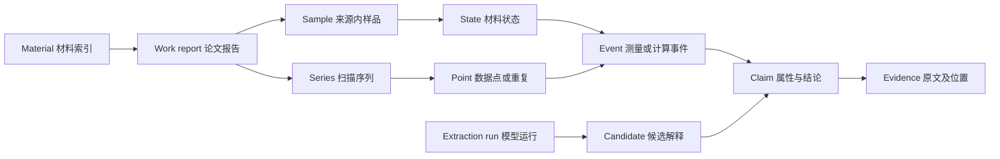

# SCLib Materials V3 与本地 NER 开发计划

计划日期：2026 年 10 月 10 日。目标是在保留当前 Materials 页面显示习惯的基础上，建立以材料为索引、以论文及条件明确的结果为证据的数据体系，并在 Mac mini 上用 Qwen3.5-9B 对 50 篇分族论文进行全文抽取和三模型比较。用户已授权从原 35B 候选切换为 9B；旧配置和收据保留。

首期交付包括新版材料页预览、可追溯的数据 schema、本地 NER worker、50 篇冻结样本及人工参照标注、Qwen/Gemini/GPT 6.1 Sol 的评估报告。50 篇用于验证架构和发现错误模式；全库自动替代还需要扩大盲测及分批运行。

当前交付状态：已实现候选 schema、0092 增量迁移、独立全文 NER/三模型适配器、持久队列与恢复、补充材料多 capture 支持、私有材料快照和沿用现有视觉体系的页面预览。50 篇候选正文已取得并解析为209个初始块；许可、依赖组、族与难例审查、补充材料范围、双人gold和最终冻结尚未完成。本轮切换9B的模型pin、资源配置及209块真实tokenizer预检已完成，10篇开发输入在本机用原始文件成功复现；Mini的9B下载、真实load及原worker排他移交按新回执分别记录。工程测试与真实模型质量验收分别记录，见[工程验收记录](SCLIB_Materials_V3_Engineering_Acceptance_2026-10-10.md)、[部署说明](SCLIB_Materials_V3_M4_Deployment_2026-10-10.md)及[来源与标注规范](pilot/materials-ner-50.review-guide.v1.md)。

**一、开发基线与必须先处理的问题**

线上参考页为 [Materials](https://jzis.org/materials)。2026 年 10 月 10 日读取到的布局是浅绿色页面背景、白色筛选区和表格、深绿色按钮、紧凑字体；默认列为 Formula、Family、Reported Tc、Conditions、Source year、Sources、Evidence status。保留 Formula contains、Family、Tc、Pressure、Result origin、Advanced filters、排序、分页、Scientific columns、Sources 和 Evidence。网站界面继续使用英语，计划及内部说明使用中文。

设计定位是科研材料目录的渐进更新。沿用当前品牌、字体、导航和路由；视觉变化主要用于展示论文分组、扫描点、缺失原因和原文证据。当前密度较高、动效很少，采用 design variance 2、motion intensity 1、visual density 8 作为设计约束。design-taste-frontend 的保留品牌、审计、响应式和可访问性原则适用；其营销页面的卡片数量与内容密度限制不作为科研表格的限制。不因重建 schema 引入新的 UI 框架。

| 已核对项 | 对开发的影响 |
|---|---|
| 线上页面已包含 Formula contains、Pressure 和 Result origin；本地分支页面文件仍是较早布局 | M0 对齐线上部署 commit、API 与本地基线，避免覆盖较新功能 |
| 本地检出分支为 codex/sclib-fulltext-projection，commit 为 71ecdc9e5f6d14413edccdbc9af04bb16f7dd5e6 | 这是规划时的代码快照，不等同线上部署 SHA |
| material_ner.py 只拼接前 8 个 section，prompt 再截前 16000 字符 | 新流程使用完整文档块清单、分段与覆盖账本 |
| sample_ner_50.py 随机取样且直接更新 papers.materials_extracted | 新建独立评估入口，禁止用旧脚本运行比较实验 |
| 既有 v2 已有样品、状态、事件、属性、证据与运行表；Tc 唯一规范存储在 material_claims | 复用既有科研主干，按新版本向前迁移，不建立第二套 Tc 真值 |
| 既有 EPC 汇总有分字段取最大值的路径 | 新版完整保存事件内的参数组合，避免跨论文或跨压力拼接 |
| Mini 为 M4 Pro、14 CPU 核、48 GB 统一内存 | 采用原生 MLX 量化推理；先单个重任务，实测内存及吞吐 |
| Mini 任务在 2026 年 10 月 10 日 08:18:05 UTC+8 的报告中仍有停机认证 pending，旧 worker 运行，24 小时验收未通过 | M0 处理原维护流程；NER 能力不能继承 QE 环境的就绪状态 |

保留已有来源许可、撤稿、争议、材料可见性及研究审核规则。重新抽取不能解除现有 source/material hold，也不恢复已暂停的生产 ingestion、NER 或 aggregation。

**二、可验收的产品目标**

1. 一个材料条目能显示多个论文报告，既保留全部可用结果，也给出明确选取规则下的简洁概览。
2. 同一论文同一材料的压力、掺杂、磁场、温度或计算参数扫描全部保留；多个 Tc 判据、重复测量和加载/卸载路径能区分。
3. 每个显示值能追到论文版本、样品、状态、事件、原始数值与单位、原文片段和位置。
4. 本地模型成为可恢复、可计量的任务节点，通过队列执行全文抽取，输出标准候选，不直接写生产材料表。
5. 50 篇样本对三个模型采用同一内容与评分规则，得到质量、速度、资源、成本和可替代范围的结论。
6. 对现有空值按字段类型标注可能的补全路径，再在 50 篇样本中逐值确认“原文可重提取”“可以确定性计算”“需要结构或进一步科学计算”“来源或抽取不可用”，给出每族、每字段的补全率。

**三、新版数据 schema**

材料索引是稳定的 material_id；化学式是主要显示和检索字段。不能把化学式字符串作为唯一数据库身份键。名字、别名、变量化学式、同位素、复合材料和异质结构也有合法表示。

核心关系如下。一个物理状态可有多个测量或计算事件；一个事件可以支持多个判据或属性。同一条件的重复测量有不同 point/event，不能按压力数字去重。

| 对象 | 主要字段 | 身份与用途 |
|---|---|---|
| Material | material_id、display_formula、identity_kind、canonical_composition、variables、isotopes、aliases、parent_material_id、identity_resolution | 跨论文归并；压力及 Tc 不进入材料身份；不确定名称保留 source-scoped 身份 |
| Work report | work_id、paper_id、source_version_id、capture_id、DOI/arXiv、publication dates、original_data_group_id | arXiv、期刊及修订版归到 work；独立原始数据组用于去重计数 |
| Sample | sample_id、work_id、sample_label、physical_specimen_group_id、composition_context、form、substrate、preparation | 样品编号只在来源内有效；相同 S1 不能跨论文视为同一样品 |
| State | state_id、material_id、sample_id、composition、phase、structure_id、typed_conditions、resolution、context hash | 区分测量、合成、结构与计算压力/温度；未知条件不能当作已知相同 |
| Series | series_id、work_id、sample_id、scan_variables、series_label、source anchors | 压力、掺杂、温度、磁场或参数扫描，允许多维扫描 |
| Point | point_id、series_id、state_id、source_occurrence_id、source order、step_index_raw、path_direction、replicate_label | 保留加载与卸载、重复实验、同压力不同结构或不同计算设置 |
| Event | event_id、state_id、point_id、event_type、method、calculation_settings、knowledge_origin、source_role、revision | 原子关联的测量/计算结果；方法或来源性质变化时拆事件 |
| Claim | claim_id、event_id、property_key、component、quantity/text、criterion、evidence links、interpretation_revision | 一条字段陈述或判据；同一事件可同时有 onset 与 zero resistance |
| Evidence | evidence_id、source version、block/page、table/row/column、span、quote、evidence_role、hash | 逐字段支持材料、值、单位、条件及方法；表头、行、脚注可多段联合支持 |
| Extraction run | run_id、input manifest、model/revision、prompt/schema hashes、parser/runtime、settings、attempts、token/time/resource/cost | LLM 是抽取工具，运行记录不改变原文结果的 Observed/Computed 属性 |
| Candidate | candidate_id、run_id、block_id、raw JSON、validation outcomes、selected interpretation links | 三模型输出先分别保存；不能当作三个科学重复实验 |
| Relations | typed claim/work/material links、relation type、comparability、evidence、review state | quotes、same_result、replicates、corrects、challenges、potential_conflict |

Material、Source/Work、Claim 的关系是多对多的来源集合与多条结果，前端可按材料聚合，底层不把全部数据压成一行。

**身份与数值规则**

- 完整化学式按明确的版本化规则规范化并保留原文。H3S/SH3 可以提出别名归并；变量未解析、同位素不同、掺杂不同或复合结构不明时不自动归并。
- 材料族采用多轴分类：composition_family、structure_motif、electronic_class、mechanism_report。传统超导是样本分层标签，不能据此自动生成“非常规=false”或确定配对机制。
- quantity 固定保存 raw_text、raw_unit、relation、value/lower/upper、approximate、uncertainty_raw；程序另外生成 normalized value/unit、transformation_rule 和版本。relation 支持 point、interval、lt/le/gt/ge；区间不取中点。
- 明确写 ambient pressure 时保存类别和原文证据；数据库旧字段的 0 编码仅作有标记的兼容投影。未报告压力保持未知。
- knowledge_origin 使用 Observed、Computed、Inferred、AI-Proposed、Unknown；source_role 使用 primary、cited、unknown，二者独立。每条 property candidate 也保存这两个字段及自己的 evidence。同一论文可含多个来源性质不同的事件；候选中的混合属性须按来源、方法和结果证据拆分后才可组装科学事件。
- sc_outcome 使用 positive_reported、not_detected、inconclusive、unknown。没有在测试窗口内发现超导不生成 Tc=0；T_min、压力、磁场、方法和检测范围另存。明确写出的 Tc 上限可以保存为带证据的 bound。
- λ_ep、penetration_depth、superfluid_density 和 superfluid_stiffness 为不同字段。μ* 是独立字段；H、B、μ0H 和不同维度的密度/刚度不能靠名称猜测互换。
- 任何派生值和后续 DFT 结果产生新事件，记录输入依赖；不覆盖论文原值。

**首期字段注册表**

| 字段组 | 首期目标字段 | 需要保留的限定 |
|---|---|---|
| 超导判据 | Tc、sc_outcome、onset/zero/midpoint/diamagnetic/heat_capacity、测量方法、检测最低温度 | 判据、样品和全部对应条件 |
| 测量条件 | P、T、B/H/μ0H、方向、测量电流、频率、样品形态、基底、厚度、应变、掺杂、氧含量、扭角 | 条件角色、单位、维度、来源 |
| 其他超导量 | Hc1、Hc2、Jc、gap、penetration_depth、coherence_length、pairing report | 温度、方向、定义、体/面/线密度与判据 |
| 高压/EPC | λ_ep、ω_log、μ*、reported Tc formula、结构/空间群、压力、声子稳定性、方法 | 同一结构、状态、方法及参数组；不按论文类型限制抽取 |
| 结构与制备 | phase、space group、晶格参数及角度、cell volume、结构文件、制备/退火、压力介质 | 结构是 measured、predicted、prototype 或仅文字描述 |
| 相互竞争的序 | 磁性/结构转变、竞争序及其温度、配对/非常规报告 | 源陈述及条件，不从材料族推断 |
| 可用于计算的输入 | composition、coordinates/artifacts、DOS、band gap、formation energy、hull energy | 原始方法、能量/粒子/化学式基准与来源版本 |

注册表规定 value type、允许单位、物理量定义、必需限定、适用状态及规范化方法；未注册字段保存在 unsupported_property 候选中，不通过任意 JSON 键进入公开数据。候选输出的 Draft 2020-12 JSON Schema 见 [materials-ner-candidate-v3.0.schema.json](schemas/materials-ner-candidate-v3.0.schema.json)。

字段覆盖状态由程序及来源检查生成：reported、explicitly_not_measured、no_claim_found、ambiguous、source_unavailable、extraction_failed、not_applicable。只有完整指定范围处理完才可生成 no_claim_found；“本次未找到”不等于论文确定未报告。model 输出不包含 review_status、validity_status、public_eligible 或“已全文覆盖”等自我验收字段。

**数据库落地方式**

复用 works/papers、来源版本和快照、materials、research_samples、material_states、research_events、research_runs、evidence_artifacts。新增 series、points、point-event bindings、字段条件与证据关联、NER candidates、解释选择、claim relations、coverage 和 material snapshot projection。

Tc/非转变结果仍只写 material_claims；已有注册的数值属性沿用 event_properties。新数值 key/单位、范围条件及定性属性通过新的 registry、向前迁移和定性 claim 表扩展。保留已发布 research_schema_v2.py 契约，不能直接改写其历史定义。旧 CHECK 约束、标量压力列和外键的兼容扩展是 M1 的明确迁移任务，必须以实际数据库 rehearsal 验证；不把有效压力范围错误投影为“未报告”或“歧义”。

新增模型分别使用候选 contract、科研存储 contract 和页面 read model。候选 local_id 只在一次输出内引用；全局 ID、来源 occurrence ID、归并及科学审核状态由程序生成。raw occurrence 身份不包含模型名、模型版本或解释值，重新抽取只形成解释版本。不同模型对同一原文的输出分别保留到 run，最终选择一个解释集合进入页面，分歧进入待核查记录。

**四、跨论文与论文内的聚合规则**

1. 材料内首先按 work、来源版本和原始数据组组织报告；一个 work 的 arXiv 与期刊版不算两次独立支持。综述引用同一原始结果也不增加独立实验数。
2. 同一 work 内按样品、序列、数据点及事件展示。表格每行直接绑定其表头/脚注；只有明确的“respectively”等对应关系才配对多组值，禁止做笛卡尔积。
3. onset 与 zero resistance 是不同 claim。加载/卸载的同一个压力数值是不同 point；不同 μ*、functional、磁性设置或结构是不同 calculation event。
4. 原文同一结果的正文/表格重复引用先记录多个 evidence occurrence，再形成可追溯的 same_result 关系。来源不完整的条目不因空条件一致而去重。
5. 不同论文只有在成分、样品状态、压力、方法、Tc 判据及计算设置可比时才评估差异；未知条件形成“可比性不足”。差异不自动宣判错误或争议。
6. 不默认求跨论文平均 Tc。若以后提供统计汇总，它是有输入清单、独立性条件与算法版本的派生结果。
7. 首屏概览使用可见性规则允许且字段证据足够的结果。默认最大 Tc 只从明确的正结果点值选取，范围/界限另列；Observed 与 Computed 标识保留。主要报告、引用报告及未知归属分开计数。
8. λ、ω_log、μ*、Tc 只有同一计算事件及其来源证据建立关联时才形成联合参数组。单独选择的结构、配对或其他属性不能装作属于首屏选中的 Tc 状态。

合成示例：论文 A 的同一 S1 样品，150 GPa 加载时 onset=240 K、zero=232 K，170 GPa 加载时 onset=250 K，150 GPa 卸载时 onset=236 K。该材料保留 3 个 point、至少 3 个 event、4 条 Tc claim。论文 B 对同成分另有一组报告，仍是同一材料条目下的另一个 work report；其样品及序列不并入 A。以上数字只说明 schema，不是 SCLib 的实测结果。

**五、新版页面的显示 contract**

列表每行仍是一个材料，默认顺序为 Formula、Family、Reported Tc、Conditions、Source year、Sources、Evidence status。Reported Tc 与 Conditions 总是引用同一 selected_result；筛选命中的结果也必须是同一条可追溯结果，不能用论文 A 的 Tc 和论文 B 的压力让材料通过筛选。

| 页面 read model | 内容与显示 |
|---|---|
| identity | material_id、display formula/name、别名和变量状态；明确的相同成分聚合 |
| selected_result | claim/event/point/work refs、Tc quantity、criterion、origin、method、conditions、source year |
| support_counts | source_ids、unique_works、primary_data_groups、result_points、cited_reports；只有确认的数据组才计 independent support，未知另计 |
| coverage_summary | 每字段来源及抽取覆盖状态；零结果、不可用及失败不混为同一空值 |
| property_summaries | 每字段独立的 selected claim/ref；λ 等联合参数用单独 bundle，不跨事件拼接 |
| report_groups | work 下的 sample/series/point；所有替代值及原文可按需加载 |
| conflict_summary | potential difference、comparability、source review状态及相关 claim refs |
| enrichment | 重新抽取、确定性派生、进一步计算产生的事件与版本 |

Sources 打开按 work 分组的报告列表，显示各报告的样品、数据点和来源版本。Evidence 先解释本行选中的 Tc 与条件，随后允许看其它报告/判据和对应原文。详情页保留当前属性分区，增加 Papers and results、Series、条件曲线和逐字段来源。

压力/掺杂曲线只连接同一 series、同一路径与同一判据的点，图例标 work/sample/criterion；不同论文和加载路径不串成一条曲线。图中可同时显示离散点、范围和不确定性。

Scientific columns 仍是可展开的可选列。缺失值显示简短英语状态及可展开解释，例如 No claim found、Source unavailable、Extraction failed、Ambiguous；方法、条件和证据用于科研判断，模型名称与队列信息保留在内部运行页。

URL、导航名、原有筛选参数、来源治理和分享链接保持兼容。新接口先在 staging 或 feature flag 下使用；详情与证据分页加载，不把所有论文全文及 claims 塞入 50 行列表。前后端同源的筛选语义要明确规定 range/bound 匹配为“确定满足”还是“可能满足”，默认采用确定满足，不能偷偷用中点匹配。

**六、Mini 模型与运行方案**

采用 [Qwen3.5-9B](https://huggingface.co/Qwen/Qwen3.5-9B) 的 [MLX 4-bit 版本](https://huggingface.co/mlx-community/Qwen3.5-9B-4bit)，dense 语言架构，safetensors 权重合计 5,950,221,072 字节，全部 13 个 snapshot 文件合计 5,977,073,303 字节。选型依据是原生 Apple Silicon 推理与较小的内存需求，NER 准确率须由本项目样本决定。原 35B 的 [pin](pilot/materials-ner-qwen3.6-35b.model-pin.archived.v1.json)及 tokenizer 回执仅作历史记录。

| 项目 | 首期配置 |
|---|---|
| model_id | mlx-community/Qwen3.5-9B-4bit |
| pinned revision | 8b2b98c00a6b4d291155e4890773ca8f769aee53；下载前核 revision，并记录逐文件 SHA-256 |
| runtime | 原生 arm64 Python + MLX + mlx-lm 的独立环境，实际加载成功后冻结版本 |
| 兼容性核查 | 核验 mlx-lm 0.32.0 的 dense qwen3_5 文本加载、vision 权重过滤和完整 chat template；真实 load/生成之前不声明兼容性通过；不改原始 snapshot |
| 初始工作窗口 | 总计 16384 tokens，body 4000–6000；schema/上下文和输出另留容量；初始 max output 4096 |
| 长段落/表格 | 保留表头与脚注，按行或语义继续分段；输出触顶就拆块，不截断并标成功 |
| 推理配置 | enable_thinking=false、temperature=0 为开发起点；10 篇开发/10 篇验证后冻结；不把模型采样参数不支持视为可强行通用 |
| 并发 | 单个模型常驻、一个推理请求；与 QE/DFPT 等重任务互斥 |
| 初始内存预算 | 9B 独立资源配置：同时记录进程 RSS 与 Metal 峰值，统一内存可能重叠，使用 max(RSS, Metal)配合主机余量守卫；峰值上限16 GiB，主机余量至少8 GiB；未实测前预估峰值12 GiB，加载前至少20 GiB当前可回收内存。上述估计待实测校准；旧35B的32/12/24 GiB配置没有被当作9B实测结果 |
| 磁盘 | 权重、缓存、环境、scratch 和日志分预算，预检建议至少 80 GiB 空闲；数据按批领取，不把全库一次性复制到 Mini |
| 服务 | worker 本机调用 runtime，若用 HTTP 则仅监听 loopback；协调器通过已有出站任务协议派发 |
| 稳定性 | 在实际低权限服务账号验证 Metal、锁屏、重启恢复及 24 小时运行；不用交互终端成功替代后台验收 |

16k 是此分块任务的工作窗口选择，不是模型最大上下文。必要时在验证集上尝试 32k 或有界 thinking，只有质量/资源测量支持才变更配置。[官方模型](https://huggingface.co/Qwen/Qwen3.5-9B) 支持 enable_thinking 控制；具体传参要核 MLX 使用的聊天模板。不能用滚动 KV 淘汰原文片段充当全文处理。[MLX LM](https://github.com/ml-explore/mlx-lm) 的 Apple Silicon 推理与缓存能力可复用，但不默认宣称其 HTTP 服务支持严格 JSON Schema 受约束解码。

先使用提示约束、JSON 解析、schema/Pydantic 校验和一次有界语法修复。修复仍失败则失败/隔离；修复不能更改科学事实，JSON 合法也不代表材料与条件绑定正确。三个模型使用相同的后处理和修复额度，并报告原始与修复后成绩。

QE 与 NER 使用不同预算、adapter 和 capability，不能消耗或改写原科学计算的已分配预算。节点当前维护认证沿用原流程，不新开重复认证窗口。完成节点联调后新增全文抽取任务能力；计算账号没有生产数据库及云 API 密钥的需求。

**七、本地 NER pipeline**

1. **文档获取**：首先选 SCLib 已有 paper/work。下载可处理和可传输的全文及可用 supplementary，保存来源许可、版本、hash 和文件清单。无法取得正文的候选在冻结前替换；不得用摘要冒充 50 篇全文。APS 等受限全文按实际许可及既有环境处理，不默认复制到 Mini 或发送云模型。
2. **解析**：优先结构化 HTML/JATS/TeX，PDF 用现有 parser/GROBID 与版面、表格处理；必要 OCR。生成稳定 block_id、section/page、表格行列和 quote offset。避免用按 section 字母排序和重叠向量 chunk 直接重建“原文”。
3. **覆盖**：正文、方法、结论、图注、表格、脚注、可用补充材料列入账本；引用列表有单独解析状态。每块记录 extracted/no_target/parser_failed/blocked/unsupported，不以空数组隐去错误。不得只处理前 8 section 或前 16000 字符。
4. **候选发现与抽取**：遍历全部目标块；材料清单和相邻标题/表头/脚注只提供可追溯上下文。先通用抽取，再对高压/EPC、变量掺杂、薄膜/基底等做共享领域校验，不能只靠关键词筛选丢掉罕见材料。
5. **JSON 与传输**：共享语义 prompt、字段字典和 schema。各 provider 使用适配的传输/结构化输出方式。拒绝未支持的格式、额外字段、NaN/Infinity；保留失败、原始输出和预算。
6. **原文与量值验证**：quote 必须能定位；值/单位的变换来自确定性规则。材料—样品—条件—方法的每个关联有证据，表头和脚注继承有规则。原文模糊的关联进入 unresolved，而不是猜测。
7. **来源内组装**：将相邻块中的同一来源结果、表格行和明示样品链接，恢复 series/point/event。未知条件不能充当 join key；不同结果的值不能靠距离最近强制配对。
8. **归并与快照**：解析别名、变量和化学式后建立 material links，保留 ambiguous/source-scoped 候选。选择解释后生成一份不可变影子快照，记录全部依赖与投影策略。
9. **交付**：输出原始候选、有效抽取结果、未解决项、覆盖与失败清单、资源/成本 manifest；由 API 读快照产生新版预览。

图中的明确标注数字和表格是 OCR/文本目标；仅曲线内的数值另建 digitization artifact，保存坐标轴、单位、图例、校准及误差，禁止模型直接猜点。首期报告分别给“共同机器可读输入上的模型成绩”与“完整源文档的端到端覆盖”。图像/曲线中的关键结果无法处理时明确计入端到端缺口，不能因此宣称全文任务完成；扩大全库前必须决定如何处理这些任务。

**任务分配与恢复**

VPS 负责冻结输入、任务队列、租约、接收、云模型比较、科学数据和材料页；Mini 出站领取本地推理任务，下载本次任务的数据并执行固定 adapter。已有 Codex 远程连接用于部署检查；批量任务不以逐篇发送聊天消息来调度。

每篇论文是父 job，每块是可恢复子任务，关键参数包括 paper/work/source hash、block manifest、model/prompt/schema/parser版本、资源上限及预算。保存 claim_request_id、attempt_id、lease/fencing token 和完成 receipt；采用至少一次执行、一次有效接纳。旧租约结果不能覆盖新解释；断网先落盘和停止领取新任务，恢复后对账，不重写成功块。

解析失败、provider 失败、JSON 失败、semantic validation 失败与合法零结果不同。基础设施最多额外两次重试；语法修复最多一次；输出长度失败改拆块，所有尝试记入覆盖、时间和成本。分块继续拆分也受每篇总时间、输出量及尝试预算约束，预算在首批 10 篇校准后冻结，耗尽时明确失败并保留覆盖缺口。取消、进程崩溃、ACK 丢失、重复提交、旧租约回传和磁盘不足都需验收。24 小时 soak 可重复运行已有本地测试任务，重复次数单独计数，不能算作新增论文；云模型不因 soak 重复调用。

**八、50 篇样本与人工参照**

已按 5 个材料族各 10 个候选 work 准备来源；这些是 SCLib 已有论文的标题引导选样，尚不能据此声称全部符合族、独立性和难例目标。真实 ID、标题、版本、URL、原始及解析 hashes 见 [来源准备收据](pilot/materials-ner-50.sources.prepared.v1.json)。其中正文输入为 24 个 PDF 和 26 个 HTML，50 个原始 PDF 也已保存；无来源获取或解析失败，全部保留图像/版面待审缺口。最终审查后形成 M1 冻结 manifest；协议中的 frozen_paper_manifest 仍为 null，NER 完成数仍为 0。

| 材料族 | 数量 | 选样方向 | 重点检查 |
|---|---:|---|---|
| 高压氢化物 | 10 | H3S、LaH10、YHx、CaHx、混合/掺杂氢化物 | 多压力、加载路径、结构、Tc 判据、λ/ω_log/μ* 同组 |
| 铜基 | 10 | La/Sr、YBCO、Bi 系、Hg 系等 | 变量式、氧含量、掺杂、磁场、配对陈述 |
| 铁基 | 10 | 1111、122、11、薄膜/界面及衍生体系 | 掺杂、压力、磁性/结构转变、不同测量 |
| 镍基 | 10 | 无限层、双层/多层、高压、不同薄膜/基底 | 薄膜与体材料、还原制备、压力、零电阻与其他判据 |
| 传统超导分层 | 10 | MgB2、Nb/NbN、A15、元素/合金及常规声子候选 | Tc、Hc2/Jc、几何/温度、EPC 方法与参数 |

材料族标签只用于分层统计；MgB2 等具体机制以原文和方法字段表达。重费米子、有机、kagome、扭转/二维等纳入下一轮扩大验证，50 篇结论不外推这些族。

每族 2 篇开发、2 篇验证、6 篇冻结盲测，总计 10/10/30。开发集可修 prompt；验证集决定资源和策略；盲测输出生成前冻结全部配置，不能看盲测结果后调整并继续称为同一盲测。来源重复版本及引用同一原始数据的依赖组放在同一 split，旧人工试抽或 prompt 示例不能进入盲测。

样本还需满足以下交叉标签目标。这些数量可以重叠，具体标签由阅读源文件确认：

- 至少 20 篇同论文同材料有多个数据点，15 篇依赖表头/脚注，8 篇有多个 Tc 判据。
- 至少 5 篇有未检出或不确定结论，10 篇有正文引用与本研究结果并存，10 篇有区间、界限或不确定性。
- 至少 10 篇有带方法/参数的计算结果；至少 5 种材料分别来自 2 个或更多独立 work，以验收跨论文聚合。
- 至少 5 篇关键证据位于旧截断范围外，用于验证全文重提取价值。
- 不能为满足标签而虚构源内容。冻结前用同族替补并记录选择过程；最后仍不足的标签如实列为未覆盖，相关验收不能假定通过。

两名具有超导文献阅读能力的标注者分别建立 source-grounded gold；分歧逐条仲裁。标注包含全部目标结果、材料/样品/状态/序列/条件/判据/来源性质及 evidence，同时记录未报告、歧义及图中数据。模型结果和多数票不能当 gold。人工 gold 评估的是“是否忠实报告原文”，不将论文科学结论认证为事实。

预计双人标注及仲裁约 8–15 人日，取决于补充材料、表格和扫描点数量；标注者当前尚未指定。这是完成质量验收的资源依赖，开发期可并行进行基础设施和页面工作。

**九、三模型公平比较**

| 模型 | 实验设置 |
|---|---|
| 本地 Qwen | 指定 MLX 4-bit revision；冻结窗口、thinking、采样与输出限制；记录原生硬件及运行环境 |
| Gemini | 以实际旧流程部署的 Gemini 型号作基准；当前代码默认 gemini-3.5-flash，M0 核日志/配置后冻结，不默认为最新型号 |
| GPT 6.1 Sol | API model 为 gpt-6.1-sol，Responses API +结构化输出；以 low reasoning 作为待验证起点，盲测前冻结 |

[GPT 6.1 Sol 官方模型页](https://developers.openai.com/api/docs/models/gpt-6.1-sol) 确认其结构化输出及 reasoning 配置；[Gemini 结构化输出文档](https://ai.google.dev/gemini-api/docs/structured-output) 用于 provider 适配。严格 schema 只解决格式，不保证字段内容正确。各 API 的 schema 子集和支持参数需适配，不向不支持的模型强制发送相同 temperature/thinking 参数。

三模型对同一 50 篇完整输入运行，正文块、补充材料、上下文、字段定义与语义 prompt 一致。配置冻结后生成全 50 篇最终对照输出；开发调参产生的旧输出另存，只有输入、配置和程序版本一致才可复用。质量门槛只用 30 篇盲测评判，其余 20 篇作为已见样本的辅助报告。允许 provider 格式和受约束解码差异；记录这些差异。使用同一归一化器、关联校验、修复额度和评分，分别比较原始候选、校验后有效候选及最终页面结果。禁止把一个模型的答案作为另一个模型的输入或用外部搜索补原文。

论文主体中的结构化数学表达、表格等使用共同解析输入，以隔离 NER 能力；端到端分数另计 OCR/解析损失。三个模型运行结果匿名化供人工核查。可把已有旧流程结果作为额外历史基线，但不把截断流程与新版全文输入混称公平模型对照。

评分单元是原文的原子结果及关联 tuple：
材料 + 来源内样品 + 状态/数据点 + property/criterion + quantity/unit + 方法 + source role/origin。
未知字段按 unknown 处理，不靠“所有字段都是 null”获得高准确率。量值容差来自原文有效数字、不确定性和合法单位变换，不用宽松百分比掩盖错误。

报告 precision/recall/F1 的 TP、FP、FN 和分母；给每族、字段、难例标签及整篇结果集合成绩。相邻扫描点相关，置信区间及配对比较以论文/数据依赖组为重采样单位，不把几百个点当作几百个独立论文。30 篇盲测不足时给“证据不足”，不做过强统计结论。

**十、首期验收矩阵**

以下是首期设计目标，需在盲测前冻结。分母不足或所需族/字段未被覆盖，标作未验收，不按零错误默认通过。

| 类别 | 验收标准 | 验收证据 |
|---|---|---|
| Schema | 所有目标字段定义了类型、单位、条件角色、证据和缺失状态；同论文多点与跨论文归并无数据丢失 | contract、registry、ER 图、数据库迁移 rehearsal |
| 核心语义 | 跨材料/跨条件错绑、把 cited 计 primary、把未检出变 Tc=0、把未知压力变 ambient 等严重错误为 0 | 盲测逐错记录；预设语义 fixtures |
| 数值 | 有报告的数值、范围/界限及单位规范化正确率至少 99%，保留全部原始表示 | 与 gold 逐字段对照，列分母与错误 |
| 核心结果关联 | Tc/结论 tuple precision 至少 98%，recall 至少 95%；每族 recall 至少 90% | 冻结盲测 30 篇及逐族成绩 |
| 原文证据 | 最终接纳候选的 locator 可定位率 100%；证据真正支持字段/关系的 precision 至少 98% | quote 自动定位检查 +人工核对 |
| 来源性质 | origin/source role macro F1 至少 98%；审核状态无模型越权产生 | 分类混淆矩阵、输出 schema 审计 |
| 扩展科学字段 | 已覆盖的 Hc2/Jc、结构、配对、EPC 等字段 macro F1 至少 90% | 每字段 gold 分母及完整错误分布 |
| 云模型比较 | 本地 tuple F1 分别相对 Gemini 和 GPT 下降不超过 2 个百分点；各自以论文为单位的配对 95% 置信区间下界不低于 -2 个百分点 | 同源输入 hashes、三模型报告；区间不确定则扩大样本 |
| 空值补全 | 50 篇覆盖的材料/来源的现有空值均区分潜在路径、已确认可补性及公开治理原因；只对 gold 表明可提取的空值计算补全 recall，目标至少 95% | 字段级 before/after、来源与补全方式，无填充率倒逼造值 |
| 全文流程 | 本地离线重跑 50 个 work；全部目标 block 有终态；没有不可见截断；全文与补充材料/曲线缺口分别报告 | 50 篇 manifest、coverage ledger、失败清单 |
| JSON | 首次原始 JSON 有效率至少 98%；接纳输出 schema 合法率 100%；失败不能变成空成功 | 原始/修复后分开统计 |
| 幂等与恢复 | 重试、丢 ACK、旧租约、崩溃/断网恢复不重复接纳、不覆盖新结果，成功块可续跑 | 故障注入收据与对账报告 |
| Mini 资源 | 9B峰值符合16 GiB初始预算及至少8 GiB主机余量；无OOM、持续swap增长或并行重任务失控；实际服务账号24小时通过 | Metal/进程树/系统压力采样；soak报告；资源配置校准并冻结 |
| 吞吐 | 以预解析样本为口径，mean 目标不超过 5 分钟/篇、p95 不超过 15 分钟/篇；同时报告完整获取/解析/排队/修复耗时 | 首批 10 篇校准及全部 50 篇耗时，不把估计当实测 |
| 聚合与 API | selected Tc 及筛选条件来自同一事件；重复版本/引用不增加独立支持；范围、负结果及旧 source hold 保留 | 端到端查询、计数、原子组合与治理回归 |
| 页面 | 保留线上默认列、筛选、排序、分页、英语 UI 与稳定路由；360/768/1440 宽度可用，键盘可打开/关闭证据 | 线上基线与新版截图、浏览器端到端检查 |
| 性能 | 在相同数据快照/环境下 list 与 detail p95 不比基线恶化超过 20%；分页不产生逐行 N+1；证据按需读取 | 基线/新版本计时、SQL 查询计划和响应大小 |
| 切换与回退 | 预览与生产数据分开；可切回旧 snapshot/read path；回退不删除新候选和源证据 | feature flag、快照及回退演练 |

mean/p95 目标用于判断全库的实际成本，若明显不达标，先在开发/验证集优化分块、输出和调度，再形成新的冻结配置；不能通过丢弃后半篇或降低证据要求提高速度。

严重语义 fixtures 至少覆盖：同压加载/卸载、同压重复测量、多 Tc 判据、μ* 多参数、实验/计算同论文、引用/主研究同论文、未知压力、明确 ambient、synthesis 与 measurement 条件、变量成分、同位素、范围/上限、未检出窗口、原文表头脚注、同一数据在正文与表格重复、arXiv/期刊重复、三模型同源候选和 source hold。

**十一、开发里程碑及交付物**

估计 16–23 个开发工作日，假设一名持续投入的工程实现者。人工标注预计另需 8–15 人日，可与开发重叠；模型下载、源文件获取及现有节点维护的等待时间按实际记录，不作为固定日期承诺。

| 阶段 | 工作量估计 | 工作与出口 |
|---|---:|---|
| M0 基线与接入 | 1–2 日 | 对齐部署 SHA；审计 API/数据库/来源权限；读取 Mini 硬件/当前维护结果；核 Gemini 实际型号、云账号可用性及预算；输出 baseline manifest |
| M1 schema 与样本 | 3–4 日 | 量值/条件/身份/series/point 定义、注册表、迁移设计及 rehearsal；冻结 50 篇真实 manifest 与 split；发布标注规范及开始双人 gold |
| M2 本地 runtime | 2–3 日 | 独立 arm64 环境、固定权重、实际服务账号加载与 16k/32k测量、adapter和队列 smoke；明确 NER capability 和单重任务预算 |
| M3 完整抽取流程 | 4–5 日 | 完整解析与 coverage、共享 provider接口、语义/证据/关联验证、来源内组装、恢复与候选快照；10 开发+10 验证篇校准并冻结 |
| M4 聚合及页面 | 3–4 日 | material read model、逐字段来源和论文/series聚合；保留现有布局，提供新版预览；查询与治理回归 |
| M5 比较与交付 | 3–5 日 | 完成 gold 后运行30篇盲测及三模型50篇全报告；24h本地soak、恢复测试、资源/成本报告；输出验收与扩大/修复决定 |

M1 必须完成 contract 和数据集冻结，M3 才能冻结模型配置；M5 依赖独立人工 gold。M4 可在已校验的开发样本快照上进行，公开切换应依据完整验收，不能把 preview 作为模型质量通过。

预计修改位置及新增模块：

| 层 | 位置与责任 |
|---|---|
| extraction | ingestion/ingestion/extract/material_ner.py 旁建立 v3模块；共享字段、provider adapters、source blocks、series assembly，不直接改旧生产入口 |
| scientific values | 复用 ingestion 与 API 的 scientific_values/result_semantics，保持共用或已有一致性检查，扩展单位注册与证据规则 |
| worker | 独立 ner_qwen_mlx adapter、runtime lock、job schema和持久状态，接现有 compute 协议；不复用自由 shell 执行 |
| database | 新 registry、series/points、候选解释和字段证据；新版本迁移及 staging snapshot |
| aggregation | 复用现有来源治理和材料可见性，替换跨字段最大值组合，提供选中结果与所有 alternatives |
| API | api/routers/materials.py 与相关 services 增加 v3 read path、分页 reports/series/evidence，保留 v1兼容 |
| frontend | frontend/app/materials/page.tsx、MaterialTable、详情页和 Evidence/Sources组件；基于对齐后的线上版本更新 |
| evaluation | 新的独立本地入口，默认只写 pilot/staging artifacts；不调用会改生产 materials_extracted 的 sample/rener脚本 |

最终交付目录至少包括：真实 paper manifest、schema/registry 与迁移、runtime lock/model文件 hashes、文档 coverage、50 篇三模型原始与校验结果、匿名人工 gold与仲裁记录、字段补全表、错误分类、性能成本报告、新版页面预览截图及验收清单。源全文的实际存储及导出范围遵循每份许可；报告与科学结构化结果另行保存。

**十二、计算补全与全库推广**

空值审计先分清 raw extraction 和公开投影：原始结果已有而公开字段为空，可能是关联不完整、字段尚未映射、来源/材料 hold 或字段不适用。每字段同时记录 extraction coverage、association status 和 visibility reason。修复字段映射属于程序任务，公开 hold 属于已有治理规则，不能将它们算作“论文漏提”或以重提取绕过限制。尚未读取全文的记录只标可能路径，不能标“确定可补”或“确定未报告”。

空值策略与 NER pipeline 共用 event/provenance，但计算补全单独排队：

| 空值类型 | 可补全方式 | 发布条件 |
|---|---|---|
| 原文已有的 Tc/P/判据/方法、结构、配对报告、EPC 参数、样品与制备 | 正文/表格/图注/补充材料重新抽取 | 来源定位及材料/状态/方法关系明确 |
| 完整固定成分的元素数、化学计量与组成描述符 | 确定性程序计算 | 成分/同位素/占位已解析，标派生规则及输入 |
| 密度、结构描述符或对称性等 | 成分、晶胞/坐标及方法计算 | 输入是同一结构和状态，不能由公式链接的另一结构代填 |
| 适用条件下的 Allen–Dynes/McMillan Tc 等 | 同组 λ/ω_log/μ* 及明确模型的派生计算 | 方法适用、参数同一事件、单位正确，标为新的 Computed 事件 |
| 能带、DOS、稳定性、声子/EPC 等 | 单独 DFT/DFPT 任务 | 有完整结构、压力/磁性/方法及预算，科学检查另行完成 |
| 源文没有定义的配对、样品相对应关系或实验 Tc | 不能靠 NER 推断补成报告值 | 保留未知，明确研究或进一步测量需求 |

铜/铁/镍等体系不能因为存在若干数值就套声子 Tc 公式。本地 LLM 的“看起来合理”不属于计算补全。50 篇只评估可重提取字段和少量确定性派生；大规模 DFT/EPC 不是本次模型替代验收的一部分。

50 篇通过后按以下次序推广：

1. 新增 200–300 篇分层盲测，包含其它材料族、不同来源格式、长补充材料和失败案例；沿用冻结配置，报告不确定性和分母。
2. 在 staging 先批量 100 篇，再 1000 篇；核错误率、未知/失败率、同材料多论文计数、吞吐及人工待核查量。
3. 冻结新版 material snapshot并完成页面切换/回退验证后，按来源和族分批重提取，持续抽查。容易的已支持场景本地执行，解析/关联未解决的场景进入人工或明确的混合流程。
4. 只有扩大评估和实际分批结果支持，才决定全部自动本地处理。50 篇通过可以支持继续开发及扩大运行，不能证明全部 SCLib 文献已达到相同精度。

全库时间以符合许可且能取得全文的实际数量 N、测得的平均每篇秒数 t 和可用率 u 计算：days=N×t/(86400×u)。例如仅用约 75000 篇规模、u=0.8 作规划，1/3/5 分钟每篇分别约 65/195/326 天。这些是假设情景；不能把数据库 paper 总数当成已经可供全文处理的作业数。质量可行和全库工期可行要分别判断。

**十三、预算与验收后的决策**

本地费用记录 wall time、耗电实测或明确的估算、磁盘、人工标注/复核及维护；本地没有逐 token API费，但并非零成本。

云比较按每个请求的实际 input/output/reasoning/cache tokens 和计费 tier统计。2026 年 10 月 10 日官方标准文本价：GPT 6.1 Sol 约 $2/$10 每百万输入/输出 tokens；Gemini 3.5 Flash global 约 $1.50/$9，reasoning计入输出。[OpenAI 模型定价](https://developers.openai.com/api/docs/models/gpt-6.1-sol)、[Google 官方定价](https://cloud.google.com/gemini-enterprise-agent-platform/generative-ai/pricing)。

若每篇所有块加总 40000 输入、4000 计费输出 tokens，50 篇两个云模型标准费用示例约 $10.80；Batch 折扣情景约 $5.40。该示例不包括额外 reasoning、修复、重跑、OCR和人工成本，也不是已发生的费用或已确认预算。M0 应冻结实际预算和超预算停止条件，开发调参的花费与盲测花费分别登记。

异常处理采用以下分支，保留全部输入、失败和解释版本：

| 情况 | 开发处理 |
|---|---|
| 指定权重加载失败 | 核对真实架构、转换版本与 runtime；先完成同一模型的兼容加载验证，不以改用另一模型宣称原选型通过 |
| 内存压力或输出触顶 | 在开发/验证集缩小语义块、拆表格、调整输出和缓存；仍遍历全部源块；新配置重新冻结，禁止静默截文 |
| 吞吐超过全库目标 | 核输出、缓存和调度，测实际全年工期；按可接受工期选择扩大资源或混合处理，质量门槛不降低 |
| 原文歧义、复杂图或 gold 缺失 | 保留 unresolved/unsupported 及完整端到端缺口，补解析/数字化/人工参照；不能把它们当正确空值 |
| 聚合、身份或页面回归 | 停止新快照激活，保留旧 read path，修映射及关联后重新投影；原始来源和模型候选不删除 |

最终评估给出三种可行动结论：达到质量与资源门槛则扩大本地运行；部分材料族/格式达标则按明确规则混合处理；核心关联错误或资源问题未解决则先修复再建立新的验证集。无法取得 gold、某字段分母不足或统计区间不能支持非劣边界时，结论应为证据不足，不能使用模型多数票替代验收。
